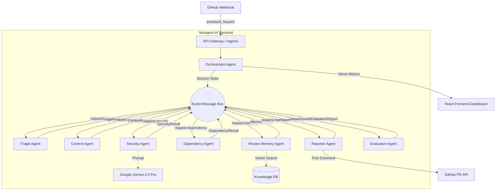

# Mutagent GitHub PR Security & Code Review Agent Architecture

## High-Level Data Flow

## Agent Responsibilities

1. **Orchestrator**: Acts as the central state machine. Transitions sessions through statuses (`CREATED` -> `TRIAGE_RUNNING` -> ... -> `COMPLETED`).
2. **Triage**: Determines PR complexity, risk, and language makeup instantly.
3. **Context**: Explores neighboring files, detects frameworks, and builds the architectural map.
4. **Security**: Deep scans for vulnerabilities using static regex engines and semantic Gemini AI reviews.
5. **Dependency**: Catches vulnerable, outdated, or malicious packages from manifest files.
6. **Review Memory**: Recalls past organizational decisions (false positives, specific strict team standards).
7. **Reporter**: Generates a beautiful Markdown executive summary for the PR comment.
8. **Evaluation**: Mutagent-native agent that continuously monitors pipeline precision and recall.
